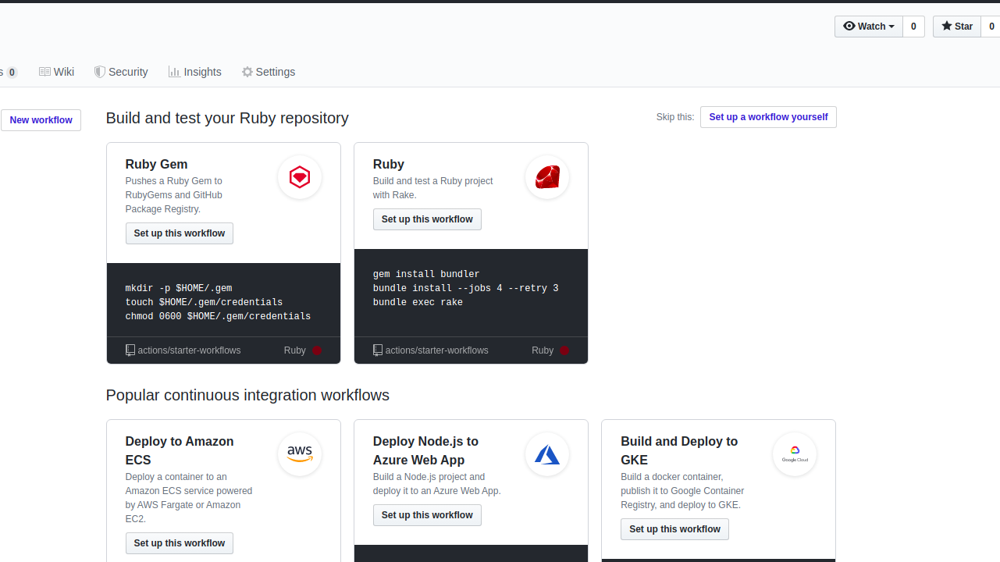
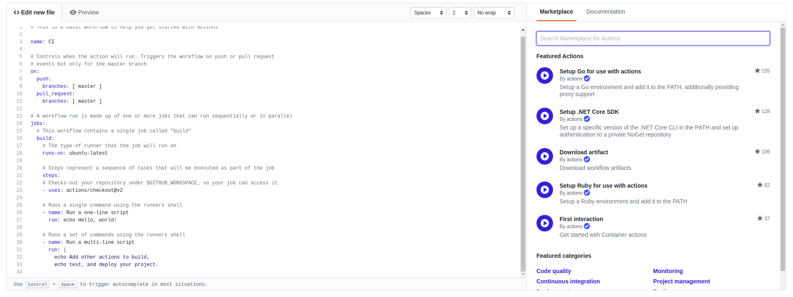

# RUBY GEMER [](https://github.com/sindresorhus/Gemmer#readme)


- You know those annoying Dependabot emails that come when a gem is not updated or is out of date? we are here to stop them for good !

- Ruby Gemer runs updates on gems in Ruby on Rails projects then tests them to increase efficiency and security.

## Installation
Ruby Gemer works with the newest version of Ruby. -> The next update will solve this problem.

After Creating a repository and pushing some Beautiful Ruby on Rails code in it, its time to automate some small annoying processes.

First, go the actions tab of your github Repository.



Click on **setup a work flow yourself**.

You can also do this manually in you local repo:

```git
mkdir -p .github/workflow/main.yaml
```

within this main.yaml file, you can do everything else we'll do from the github editor.

***Next step***

go to the marketplace tab and search ***Ruby Gemer***.

***N/B*** The marketplace is next to the editor as shown below:


Search for Ruby Gemer and select the latest version.

Copy and paste this lines of code into your main.yaml file

```yaml
- name: Ruby Gemer
  uses: katungi/Ruby-Gemer@V0.1-alpha
```
Warning -> Yaml can be very volatile when it comes to indentation.

With that, you are all set. Your full code should look something like:

```yaml

name: CI
on:
  push:
    branches: [ master ]
  pull_request:
    branches: [ master ]

jobs:
  build:
    runs-on: ubuntu-latest
    steps:
 
    - uses: actions/checkout@v2
    - name: Ruby Gemer
      uses: katungi/Ruby-Gemer@V0.1-alpha
   
```


And by that you have set up a simple ***Gemer*** Workflow

## Contributors

[Daniel Dennis](www.github.com/katungi)

## Contribution

- To contribute, Just Work on the ptoject and create a pull request detailing what you have done.
- Anyone willing to test the Action is welcome to do so and leave issues.